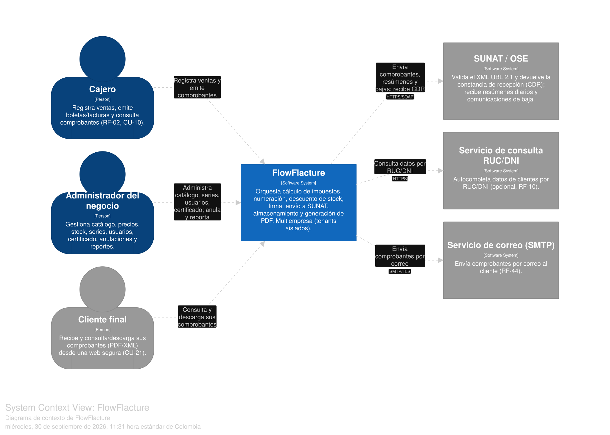
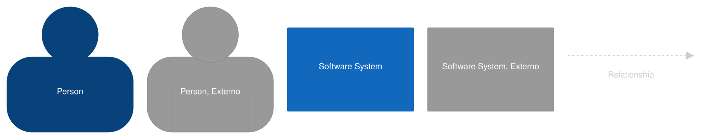
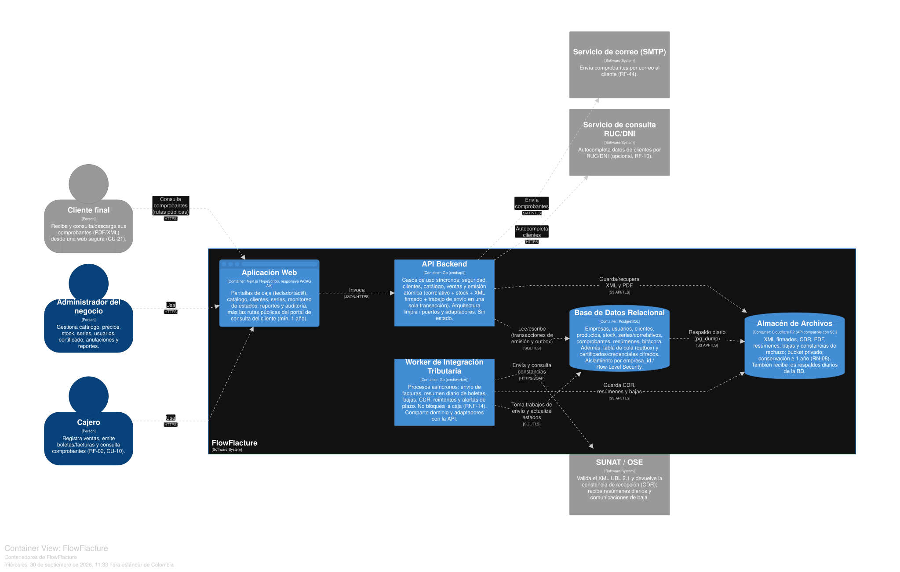
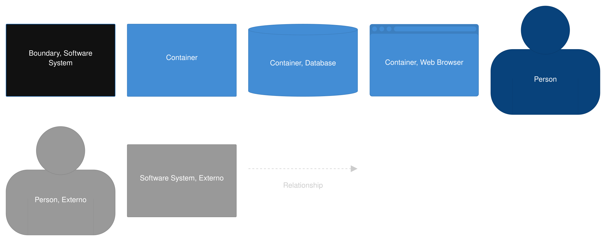
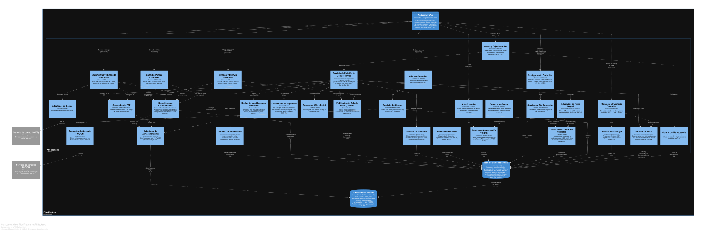
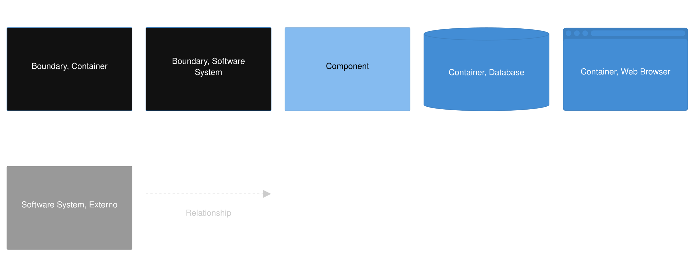
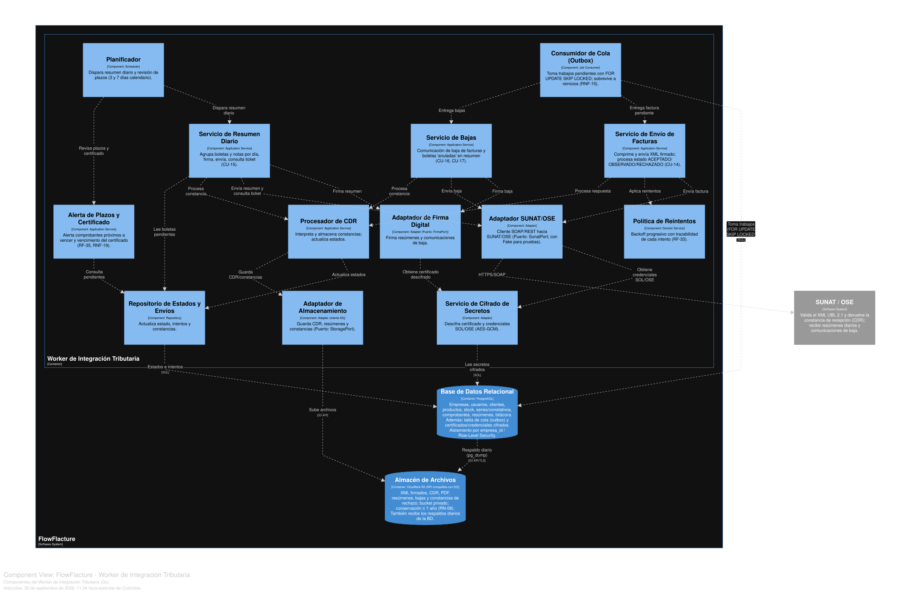
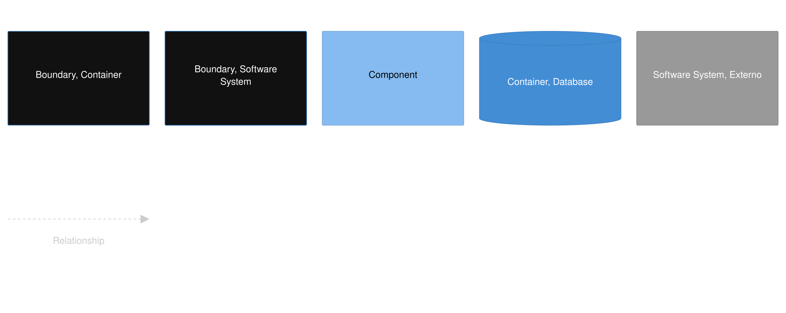
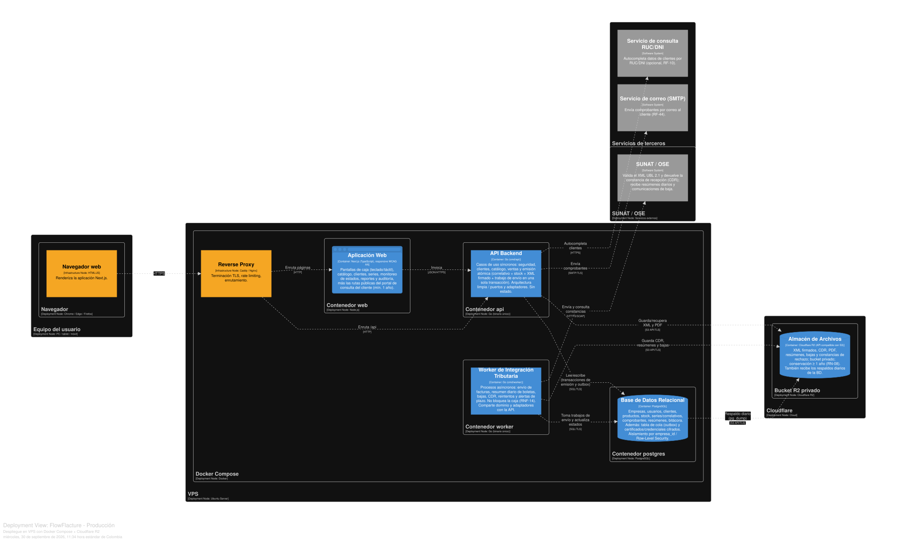
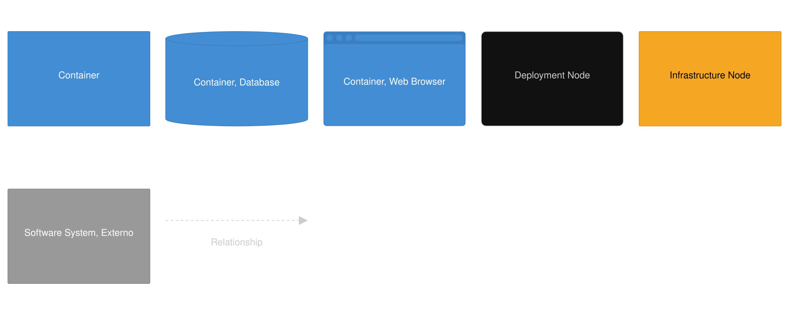

# Arquitectura técnica del proyecto

> [!NOTE]
> Las decisiones de diseño que sustentan esta arquitectura se encuentran en la carpeta de [ADRs](./ADRS/).

Este documento describe la arquitectura de **FlowFlacture** (Sistema de Gestión y Facturación Electrónica) usando el modelo **C4**, que permite explicar el sistema en cuatro niveles de detalle, del más general al más específico:

| Nivel | Diagrama | Pregunta que responde |
|---|---|---|
| C1 | Contexto | ¿Quién usa el sistema y con qué otros sistemas se relaciona? |
| C2 | Contenedores | ¿Qué piezas desplegables lo componen y cómo se comunican? |
| C3 | Componentes | ¿Cómo está organizado el interior de cada contenedor (API y Worker)? |
| D1 | Despliegue | ¿Dónde y cómo se ejecuta todo en producción? |

**Stack elegido:** Go (backend: API y Worker), Next.js (frontend), PostgreSQL (datos, cola y secretos cifrados), Cloudflare R2 (archivos) y un VPS con Docker Compose.

---

## Diagrama de Contexto

**Leyenda**

**Personas**

| Actor | Qué hace con el sistema |
|---|---|
| **Cajero** | Registra ventas, emite boletas y facturas, consulta comprobantes. |
| **Administrador del negocio** | Gestiona catálogo, precios, stock, series, usuarios y certificado digital; anula comprobantes y revisa reportes y auditoría. |
| **Cliente final** | Consulta y descarga sus comprobantes (PDF/XML) desde una web segura. |

**Sistemas externos**

| Sistema | Relación con FlowFlacture |
|---|---|
| **SUNAT / OSE** | Recibe comprobantes, resúmenes diarios y bajas; valida el XML UBL 2.1 y devuelve la constancia de recepción (CDR). |
| **Servicio de consulta RUC/DNI** | Autocompleta los datos del cliente (opcional; si no está disponible se ingresa a mano). |
| **Servicio de correo (SMTP)** | Envía el comprobante por correo al cliente. |

---

## Diagrama de Contenedores

**Leyenda**

| Contenedor | Tecnología | Responsabilidad |
|---|---|---|
| **Aplicación Web** | Next.js (TypeScript) | Pantallas de caja (operables con teclado y táctil), catálogo, clientes, series, monitoreo de estados, reportes y auditoría. Incluye las rutas públicas del portal de consulta del cliente. |
| **API Backend** | Go (`cmd/api`) | Casos de uso síncronos: seguridad, clientes, catálogo, ventas y emisión. No guarda estado, por lo que se puede escalar horizontalmente. |
| **Worker de Integración Tributaria** | Go (`cmd/worker`) | Procesos asíncronos: envío de facturas, resumen diario de boletas, bajas, procesamiento del CDR, reintentos y alertas de plazo. Comparte dominio y adaptadores con la API. |
| **Base de Datos Relacional** | PostgreSQL | Datos del negocio (empresas, usuarios, clientes, productos, stock, series, comprobantes, bitácora). También contiene la cola de envíos (outbox) y los certificados y credenciales cifrados. |
| **Almacén de Archivos** | Cloudflare R2 (API S3) | XML firmados, CDR, PDF, resúmenes y constancias, con conservación mínima de un año. Recibe además el respaldo diario de la base de datos. |

### Flujo principal: emisión de un comprobante

1. El cajero confirma la venta en la **Aplicación Web**.
2. La web llama a la **API** enviando una clave de idempotencia (evita duplicados si hay reintentos por fallo de red).
3. La API abre **una transacción** en PostgreSQL: descuenta stock, toma el siguiente correlativo, guarda el comprobante en estado PENDIENTE y registra el trabajo de envío.
4. La API genera el XML firmado y el PDF, los guarda en **R2** y devuelve el comprobante a la caja.
5. El **Worker** toma el trabajo pendiente de la base de datos, envía el XML a **SUNAT** y recibe el CDR.
6. El Worker guarda el CDR en R2 y actualiza el estado (ACEPTADO, OBSERVADO o RECHAZADO).

### Decisiones relevantes

- **La cola vive en PostgreSQL** (patrón outbox con `FOR UPDATE SKIP LOCKED`). El trabajo de envío se inserta en la misma transacción de emisión, lo que garantiza atomicidad, y la cola sobrevive a reinicios. Además evita operar un broker adicional.
- **Los secretos se cifran en la base de datos** (AES-GCM, con la llave maestra en variable de entorno) en lugar de usar un gestor de secretos dedicado, que sería excesivo para un VPS pequeño.
- **Un solo backend con todo** (catálogo, inventario y emisión): permite que el descuento de stock y la numeración sean atómicos en una única transacción.

---

## Diagrama de Componentes

Muestra el interior de los dos contenedores Go. Los componentes siguen la estructura de arquitectura limpia: controladores (entrada), servicios de aplicación y dominio (reglas), y adaptadores (salida hacia BD, SUNAT, archivos, etc.).

### API

**Leyenda**

**Seguridad y configuración**

| Componente | Función |
|---|---|
| Auth Controller / Servicio de Autenticación y RBAC | Login, expiración de sesión, bloqueo por intentos fallidos, roles Cajero y Administrador. Contraseñas con hash adaptativo (Argon2/bcrypt). |
| Contexto de Tenant | Middleware que resuelve la empresa de cada petición e impone `empresa_id` en todas las consultas. Es la base del aislamiento entre empresas. |
| Configuración Controller / Servicio | Datos de la empresa emisora, series de comprobantes, certificado digital y credenciales SOL/OSE/PSE. |
| Servicio de Cifrado de Secretos | Cifra y descifra certificados y credenciales con AES-GCM antes de guardarlos en PostgreSQL. |
| Servicio de Auditoría | Bitácora de acciones sensibles (emisión, anulación, cambio de precio, ajuste de stock, cambio de certificado). |

**Clientes, catálogo e inventario**

| Componente | Función |
|---|---|
| Clientes Controller / Servicio | Alta, búsqueda y validación de RUC/DNI; autocompletado mediante el adaptador de consulta externa. |
| Catálogo Controller / Servicio | Productos con su afectación de IGV, y carga masiva desde CSV/Excel con reporte de errores. |
| Servicio de Stock | Descuento y reversa atómicos con movimientos trazables; el stock nunca queda negativo, ni con ventas simultáneas. |

**Ventas y emisión (núcleo del dominio)**

| Componente | Función |
|---|---|
| Ventas y Caja Controller | Recibe la confirmación de venta con su clave de idempotencia. |
| Control de Idempotencia | Devuelve el comprobante ya emitido si llega un reintento con la misma clave. |
| **Servicio de Emisión de Comprobantes** | Orquestador del caso de uso: coordina todos los componentes siguientes dentro de una transacción única. |
| Reglas de Identificación y Validación | Umbral de S/ 700 para boletas, RUC obligatorio en facturas; valores parametrizables, no dispersos en el código. |
| Calculadora de Impuestos | IGV 18 % según la afectación de cada línea (gravado, exonerado, inafecto), con aritmética decimal exacta y redondeo documentado. |
| Servicio de Numeración | Serie y correlativo únicos y consecutivos, con bloqueo transaccional: sin duplicados ni saltos. |
| Generador XML UBL 2.1 | Construye el XML según los catálogos de SUNAT. |
| Adaptador de Firma Digital | Firma el XML con el certificado de la empresa (propio o vía PSE). Puerto `FirmaPort`. |
| Generador de PDF | Representación impresa con código QR; se puede regenerar si falla. Puerto `PdfPort`. |
| Repositorio de Comprobantes | Persistencia, estados y trazabilidad; los comprobantes emitidos son inmutables. |
| Publicador de Cola (Outbox) | Inserta el trabajo de envío en la misma transacción de emisión. |
| Adaptador de Almacenamiento | Sube y descarga archivos de R2. Puerto `StoragePort`. |

**Consulta, documentos y reportes**

| Componente | Función |
|---|---|
| Estados y Reenvío Controller | Panel de estados, reenvío manual, bajas de facturas y boletas. |
| Documentos y Búsqueda Controller | Búsqueda de comprobantes, descarga de PDF/XML/CDR, envío por correo. |
| Consulta Pública Controller | Atiende el portal del cliente: valida los datos de verificación y limita los intentos fallidos. |
| Servicio de Reportes | Reporte diario de ventas y exportación a CSV/Excel. |
| Adaptadores de Correo y de Consulta RUC/DNI | Clientes hacia los servicios externos, con degradación controlada si no están disponibles. |

### Worker

**Leyenda**

| Componente | Función |
|---|---|
| Planificador | Dispara el resumen diario de boletas y la revisión de plazos (3 días para facturas, hasta 7 para boletas). |
| Consumidor de Cola (Outbox) | Toma trabajos pendientes de PostgreSQL con `FOR UPDATE SKIP LOCKED`, de modo que varias instancias del worker no procesen el mismo trabajo. |
| Servicio de Envío de Facturas | Comprime y envía el XML firmado y procesa el resultado. |
| Servicio de Resumen Diario | Agrupa boletas y notas por día de emisión, firma el resumen, lo envía y consulta el ticket de SUNAT. |
| Servicio de Bajas | Comunicación de baja de facturas; boletas con estado "anulado" dentro del resumen diario. |
| Procesador de CDR | Interpreta la constancia de SUNAT, la almacena y actualiza el estado del comprobante. |
| Política de Reintentos | Backoff progresivo ante fallos o indisponibilidad de SUNAT, dejando trazabilidad de cada intento. |
| Alerta de Plazos y Certificado | Avisa de comprobantes próximos a vencer su plazo y del vencimiento del certificado digital. |
| Adaptador SUNAT/OSE | Cliente hacia SUNAT. Puerto `SunatPort`, con implementación simulada para pruebas. |
| Adaptador de Firma y Servicio de Cifrado de Secretos | Firman resúmenes y bajas con el certificado descifrado. |
| Adaptador de Almacenamiento | Guarda CDR, resúmenes y constancias en R2. |
| Repositorio de Estados y Envíos | Actualiza estado, intentos y constancias en PostgreSQL. |

---

## Diagrama de Despliegue

**Leyenda**

| Nodo | Contenido | Notas |
|---|---|---|
| **Equipo del usuario** | Navegador web | Desde aquí acceden cajeros, administradores y clientes por HTTPS. |
| **VPS (Ubuntu Server) con Docker Compose** | Reverse proxy (Caddy o Nginx), contenedores `web`, `api`, `worker` y `postgres` | La configuración se inyecta por variables de entorno para tener un despliegue reproducible. PostgreSQL usa un volumen persistente. |
| **Cloudflare R2** | Bucket privado | Almacena los archivos del sistema y los respaldos. No se expone públicamente: el acceso es a través de la API. |
| **SUNAT / OSE** | Servicio externo | Recibe envíos del worker. |
| **Servicios de terceros** | Consulta RUC/DNI y correo SMTP | Servicios externos opcionales. |

**Puntos clave**

- El **reverse proxy** termina TLS, aplica rate limiting y enruta las páginas hacia `web` y `/api` hacia `api`.
- **Respaldo:** un `pg_dump` diario hacia R2 cumple el objetivo de pérdida máxima de datos de 24 horas. La restauración debe probarse periódicamente.
- **Escalado:** `api` y `worker` no guardan estado, así que más adelante pueden replicarse, o migrarse a varios servidores, sin cambiar el diseño. El consumo con `SKIP LOCKED` permite varios workers en paralelo.
- **Seguridad:** toda comunicación usa TLS; el certificado digital y las credenciales viven cifrados en PostgreSQL, nunca en el repositorio ni en los logs.

---